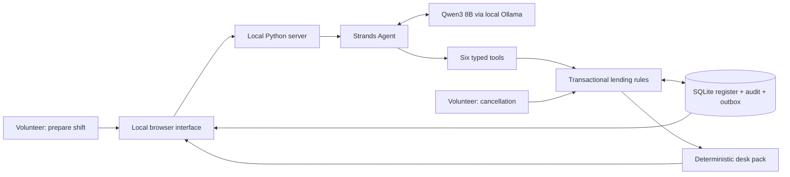

# From handover to desk pack

The model selects the next action. The domain layer owns facts, allowed state transitions and formatting of the final artifact. The UI reads committed records and a tool trace; it never interprets the model's final prose as proof that something happened.

## States

An item is `available`, `on_loan` or `maintenance`. Only an exact authenticated demo return ticket can transition a matching current loan to available. There is no model tool for clearing maintenance.

A request begins `pending`, becomes `reserved` or `attention`, and can be `cancelled` by the volunteer through the UI. A cancellation reopens exceptions in that category. A reservation links an item and a half-open time window. Every stock write and reservation decision runs in an immediate SQLite transaction.

`inspect_request` returns the register revision and currently eligible items. `reserve_item` checks that revision, queue order, category, stock status and overlap again inside the transaction. Its unsent outbox draft is committed with the booking. Model-proposed IDs do not bypass these checks.

`flag_exception` refuses to hide available stock and constructs its explanation from database facts. `prepare_desk_pack` refuses to finish with pending requests, actionable exceptions or unapplied released return tickets. The run is marked complete only when the final artifact matches the final register revision.

## Duplicate and failure behavior

The same return ticket can only be applied once. A duplicate reservation of the same item returns the existing outcome without a new event or notice. Cancellation marks an earlier draft void. Interrupted model inference can leave valid individual transactions committed; the next run reads the actual current state and continues. The process does not claim all-or-nothing atomicity across a whole agent run.

There is one web agent run at a time. Reset and cancellation are disabled while it runs. The CLI workspaces are separate from the UI workspace. Requests are held in memory only during a model invocation; durable records are in local SQLite. No borrower records or prompts are sent to a hosted model.

## Deliberate limits

The prototype has a manually started workflow, fixed synthetic input and no external messaging or paid APIs. It proves the local register-to-artifact loop. It does not yet prove compatibility with a real library system or benefits to a real volunteer group. Those require a willing library partner, authenticated data integrations and an adult staff walkthrough.
